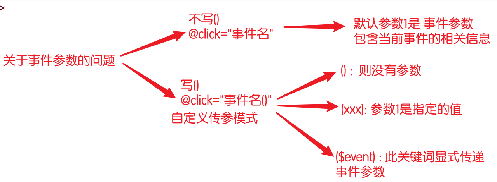
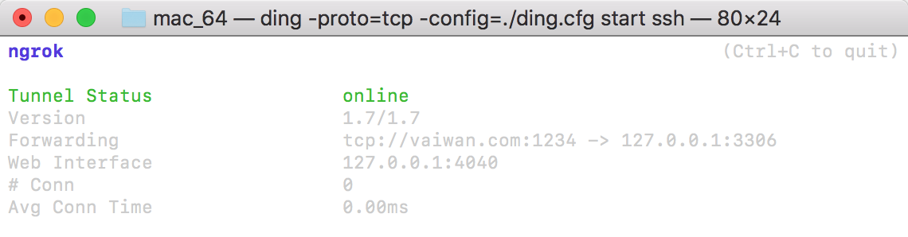

# vue

> 全局安装vue脚手架  `npm i -g @vue/cli`
>
> 官方API： [vue2](https://cn.vuejs.org/v2/api)   [vue3](https://v3.cn.vuejs.org/api/)   [vue/cli](https://cli.vuejs.org/zh/guide/)   [vue/devtools](https://devtools.vuejs.org/)

## 1.vue-cli

- [vue/cli](https://cli.vuejs.org/zh/guide/)  是一个基于Vue.js进行快速开发的完整系统，称为脚手架工具

- 初始化配置项目依赖

- 提供单文件组件

### 1.1 创建项目包

#### 1.1.1 安装/升级脚手架

安装：`npm install -g @vue/cli`

升级：`npm update -g @vue/cli`

#### 1.1.2 创建命令

`vue create 项目名`

- 项目名不允许有大写字母, 只能是 `小写字母 - 或 _`

- 项目路径中`不允许`有中文和特殊符号

- 目录下不能有同名文件夹

```powershell
vue create [项目名称]
```

#### 1.1.3 手动配置项

- ( ) Babel ：转码器，可以将ES6代码转为ES5代码，从而在现有环境执行。
-  TypeScript： TypeScript是一个JavaScript（后缀.js）的超集（后缀.ts）包含并扩展了 JavaScript 的语法需要被编译输出为 JavaScript在浏览器运行
- ( ) Progressive Web App (PWA) Support：渐进式Web应用程序
- ( ) Router ： vue-router（vue路由）
- ( ) Vuex ： vuex（vue的状态管理模式）
- ( ) CSS Pre-processors ： CSS 预处理器（如：less、sass）
- ( ) Linter / Formatter ：代码风格检查和格式化（如：ESlint）
- ( ) Unit Testing ：单元测试（unit tests）
- ( ) E2E Testing ： e2e（end to end） 测试

### 1.2 运行服务器

- 在vue-pro 目录下执行启动命令:

- vue项目包必须用自带的服务器, 在浏览器手动访问: `localhost:8080`

```powershell
npm run serve
```

### 1.3加载流程

- localhost:8080: 访问的是 `index.html`
- main.js: 引入了 App.vue , 然后加载到 `id=app` 的元素上
- App.vue: 导出vue代码

### 1.4 编译

```shell
npm run build
```

#### 1.5 本地服务器

**vue项目执行npm run build之后生成的dist文件**，**不能直接通过vscode开启服务访问，会报错**

```shell
安装
serve  npm install serve -S -g 
启动服务
serve dist
```

## 2.vue2基础使用

### 2.1 创建vue对象

`new Vue()`: 创建时有固定的初始化`配置项`：

#### 2.1.1 DOM

- el : 初始化vue对象时, 设定vue对象管理的元素, 值 id选择器
- render(渲染): 手架中使用, `main.js`文件. 用于加载 `.vue` 文件到 vue对象里

#### 2.1.2 数据

- data：存储使用到的数据, 可以在HTML中使用
  
  - `data(){}`
  - 数据都是存储在 `vue`对象里
  - data中存在数组时，索引操作与length操作无法自动更新视图，需要借助`Vue.set()`方法代替。示例：`Vue.set(vm,index,newMessage)`
  - `data是个函数, 为什么是函数?`
  
     `因为: 组件在复用时, 会调用此函数临时生成一个新的对象`
  
     `所以: 每个组件中的 数据都是不同的对象. 因为各生各的`
  
- methods： 绑定给元素的方法

  - `methods:{}`
  - 方式中的this指向: `当前vue对象`

- computed：称为计算属性

  - `computed:{}`
  - 配置：`function(){return ...}`
  - Vue.js的视图不建议书写复杂逻辑，这样不利于维护
  - 计算属性使用时为属性形式，访问时会自动执行对应的函数。存放在这里的函数, 使用时不用(), 会自动触发. 
  - 具有缓存性，计算后可以存储结果，可以减少函数运行次数，提高效率
  - 仅适用于计算操作

```js
//普通写法
new Vue({
  data:{
    a:1,
    b:2
  }
  computed:{
    fullName(){
      return this.a + this.b
    }
  }
})
//getter与setter分开写法
new Vue({
  data:{
    a:1,
    b:2
  }
  computed:{
    fullName(){
  		get(){
        return this.a + this.b
      },
      set(newValue){
        ....
      }
    }
  }
})
```

- props：外来的属性

  - `props:{}`
  - 理解成 组件的形参, 接收组件使用时传入的实参
  - 父子传参：`props:[....]`
  - 精确配置：`props:{kw:{default: 1}} `...

- watch：监听器，监听一个属性的变化

  - `watch:{}`
  - 配置：`func(newValue,oldValue){...}`
  - 注意：对数组进行监听时，监听不到数组的索引与length操作

```js
//watch 无法直接监听对象内部属性的修改
//为了监听对象内部的变化，需要将watch书写为对象，并设置deep:true
new Vue({
  watch:{
    obj:{
      deep:true,
      //直接修改对象内部属性，对象本身并不变，所以new和old指向同一个对象
      handler(newValue){
        ....
      }
    }
  }
})
```


#### 2.1.3 资源

- directives：指令
  - 自定义指令都是 `v-` 开头
  - 参数1: 代表指令所在的元素，参数2: 指令的值, 通过=赋值的
  - 两种语法
    - 值是函数: 在DOM元素创建时触发, 还未展示到页面 `func(el,bindings){...}` 
    - 值是对象: 精确配置触发的时机。例如: `{inserted(el){...}}` 
- components：组件
  - 默认语法: `components: {组件名}`  组件名就是标签名
  - 自定义语法: `components:{标签名: 组件名}`

- filters：过滤器，通过过滤器的处理, 把返回值显示到页面上
  - 使用：`{{ 值 | 过滤器 }}`
  - 配置：`func(值){...}`，返回值就是过滤后的结果

#### 2.1.4 生命周期

- 见2.8

#### 2.1.5 事件与特殊属性

  - 在HTML中提供了新的语法, 代表DOM操作

  - `{{}}` 插值语法, 类似 模板字符串的 `${}`  其中可以书写 JS代码

  - 属性绑定语法

    - vue1写法 `v-bind:属性名=""`
    - vue2写法 `:属性名="JS代码"`

  - 事件绑定语法

    - 事件关联的方法, 必须书写在methods属性里

    - vue1写法 `v-on:事件名`

    - vue2写法 `@事件名`

      使用的差异: 如果方法不需要传递实参 `可以省略()`

```vue
<button @click="事件方法" ></button>
<button @click="事件方法(实参, 实参)" ></button>
```




**特殊属性**

- ref
  - `<input type="text" ref="自定义" />`
  - 把变量和元素绑在一起，变量会存储在 vue的 $refs 属性里
  - 例如设置颜色`this.$refs.自定义.style.color = 'green'`
- key
  - :key="唯一标识"
  - key为元素添加唯一标识，在数组内容发生修改的时候, 可以提高性能, 直接复用元素 

#### 2.1.6 注意事项

- 图片在JS中使用, 必须用 require 方法引入, 否则无法加载

### 2.2 vue指令

指令: 就是vue提供的一些特殊的属性, 都是`v-`开头

#### 2.2.1 v-show

- 显示还是隐藏-- 适合频繁切换隐藏的场景。
- 底层利用css display:none 实现，因此template不能用v-show
- `<p v-show="true"></p>`

#### 2.2.2 v-if

- 移除/添加元素，适合不频繁的, 特别是一次性的隐藏/显示。
- `<p v-if="true"></p>`
- `v-else-if`,`v-else`同理
- 当v-if,v-else-if,v-else内部标签相同时，需要用key指定唯一性，避免出现问题，例如相同input标签内用户输入的值重新渲染时不变
- v-if与v-for应用于同一标签时，v-for的优先级高于v-if。出于性能考虑，应避免将v-if与v-for应用于同一标签。可将v-if放于父级标签中。

#### 2.2.4 v-once 

- 使插值表达式只生效一次, 后续不更新。
- `<p v-once></p>`

#### 2.2.5 v-pre

- 原样输出 `{{}}`。
- `<p v-pre></p>`

#### 2.2.6 v-text/v-html

- 对应 innerText 和 innerHTML，替换原内容。
- `<p v-text="kw">111</p>`

#### 2.2.7 v-for

- 遍历数组 生成元素
- 语法:
  - v-for="值 in/of 数组"
  - v-for="(值,索引) in/of 数组"
  - v-for="(值,键,索引) in 对象"
  - v-for="值 in/of 数字"
  - v-for="(值,索引) in/of 数字"
- `:key`
  -  给生成的元素添加唯一标识，提高渲染性能并避免问题
  - 用途:当`数组有变化`时, 提升元素重用的效率;  
  - 不推荐使用索引，因为数组变化时索引也变化，不是唯一值
  - 当元素不重复时，可将元素作为key，当元素可能重复时，可给每个元素设置id
- `<template>`
  - 模板占位符，可以将部分元素或内容作为整体进行操作
  - 模板占位符不需要设置key ，key只能设置在真实的元素上

#### 2.2.5 v-on

- 事件绑定语法 .   原生事件 onclick
- vue2中提供了语法糖:    `@事件名=""`

#### 2.2.6 v-bind

- 属性绑定语法
- vue2中提供语法糖： `:属性名=""`
- 允许使用表达式
- 如果需要一次绑定多个属性，还可以绑定对象`v-bind="obj"`
- `:class`
  - :class可以跟class并存
  - 多个动态class:`：class="{cls1:true,cls2:false,cls3:true}"`
  - 固定与动态并存：`：class="[cls1,{cls2:false},cls3]"`
- `:style`
  - :style可以与style共存
  - 多个动态style:`:style="{width:'100px',height:'200px'}"`
  - 数组写法：`:style="[styleObj1,styleObj2]"`
  - 注意属性名带 `_`  需要小驼峰 或 字符串

#### 2.2.7 v-model

- 双向绑定（input,textarea,select...）,实时变化绑定的数据
- 会自动判断所在的元素类型, 然后为对应的属性绑定值
- `v-model="变量"`
- 表单元素: 输入框, 单选框, 多选框, 下拉选框.. 用户能操作修改值
  - input：绑定value,字符串值
  - textarea：绑定value,字符串值
  - radio：绑定value,字符串值
  - checkbox：单个:布尔值，多个:value，数组
  - select：单个:value,字符串，多个:value,数组

#### 2.2.8 v-slot

- 插槽
- 组件负责布局操作, 使用插槽作为占位符使用
- 组件在使用时, 其双标签写法中的内容, 会替换掉插槽
- 命名插槽: `<slot name='名字'/>`
  - 使用时有3种语法
  - slot='名字'   - vue1
  - v-slot:名字   - vue2
  - #名字  - vue2语法的语法糖

### 2.3 修饰符

#### 2.3.1 [事件修饰符](https://cn.vuejs.org/v2/guide/events.html#%E4%BA%8B%E4%BB%B6%E4%BF%AE%E9%A5%B0%E7%AC%A6)

- `.prevent`
  - 阻止默认事件行为，相当于`event.preventDefault()`
  - 示例：`@click.prevent`，阻止默认行为
  - 示例：`@click.prevent="fn"`，阻止默认行为并执行fn
- `.stop`
  - 阻止事件传播，相当于`event.stopPropagation()`
  - 冒泡：当上级元素与子元素拥有相同事件时，触发子元素事件后，上级元素的事件也会触发
  - 示例：`@click.stop="fn"`
  - 多个修饰符可以同时使用：`@click.prevent.stop="fn"`
- `.once`
  - 用于设置事件只触发一次
  - 示例：`@click.once="fn"`
- `.native`
  - 为自定义组件绑定原生事件`必须`使用`.native`修饰符
  - 示例：`<my-component @click.native="handleClick">Click Me</my-component>`
- `.capture`
  - 添加事件监听器时使用事件捕获模式，即内部元素触发的事件先在此处理，然后才交由内部元素进行处理
  - 示例：`<div v-on:click.capture="doThis">...</div>`
- ...

#### 2.3.2 [按键修饰符](https://cn.vuejs.org/v2/guide/events.html#%E6%8C%89%E9%94%AE%E4%BF%AE%E9%A5%B0%E7%AC%A6)

- 按键码
  - 将按键的按键码作为修饰符标识按键
  - 示例：`@keyup.49="fn"`，49为按键1的按键码，当按键1弹起时，触发fn
  - 示例：`@keyup.a="fn"`，当按键a弹起时，触发fn
- 特殊按键
  - esc/enter/delete/tab/space....
  - 不同浏览器下特殊按键的keycode可能不一致，因此可以直接使用`@keyup.enter="fn"`
- 连写
  - `@keyup.a.b.c="fn"`，按下a/b/c任意一个即可触发fn

#### 2.3.3 [系统修饰符](https://cn.vuejs.org/v2/guide/events.html#%E7%B3%BB%E7%BB%9F%E4%BF%AE%E9%A5%B0%E9%94%AE)

- 系统按键指的时ctrl/alt/shift等
- 系统按键通常与其他按键组合使用
- `.ctrl`/`.alt`/`.shift`
  - 单独使用.ctrl不生效
  - 示例：`@keyup.17.q="fn"`，17是左ctrl的keycode,该代码表示点击左`ctrl或q`时，触发fn
  - 示例：`@keyup.ctrl.q="fn"`,该代码表示点击`ctrl和q`时，触发fn
- `.meta`：windows中代表win，mac中代表command
- `.exact`
  - 精准配置
  - 示例：`@keyup.ctrl.exact="fn"`,该代码表示点击ctrl，触发fn

#### 2.3.4 [鼠标修饰符](https://cn.vuejs.org/v2/guide/events.html#%E9%BC%A0%E6%A0%87%E6%8C%89%E9%92%AE%E4%BF%AE%E9%A5%B0%E7%AC%A6)

- `.left`/`.right`/`.middle`
  - 示例：`@click.right="fn"`，右键点击触发fn

- v-model[修饰符](https://cn.vuejs.org/v2/guide/forms.html#%E4%BF%AE%E9%A5%B0%E7%AC%A6)
  - `.trim`
    - 过滤用户输入内容首尾两端的空格
    - 示例：`v-model.trim="value"`
  - `.lazy`
    - 用于将v-model的触发方式由input事件触发更改为change事件触发
    - 示例：`v-model.lazy="value"`，当失去焦点时，才会触发双向绑定
  - `.number`
    - 用户输入的值均为字符串
    - 将用户输入的值转为数值类型，如无法被parseFloat()转换，则返回原始值
    - 示例：`v-model.number="value"`

### 2.4 自定义指令

指令作用：简化dom操作

#### 2.4.1 自定义全局指令

- 指在所有Vue实例中均可使用的自定义指令

```js
//可以在所有Vue实例中使用
Vue.directive('focus',{
	inserted:function(el,binding){
    console.log(binding)；//binding中存储了修饰符，值等内容
		el.focus();
	}
})
```

```vue
<input v-focus type="text">
```

#### 2.4.2 自定义局部指令

- 指在当前Vue实例或者组件中使用的自定义指令

```js
//只能在id="app"的Vue实例中使用
new Vue({
  el:'#app',
  directives:{
    focus:{
      inserted(el){
        el.focus();
      }
    }
  }
})
```

（3）钩子函数

一个指令定义对象可以提供以下几个钩子函数：

- `bind`：只调用一次，指令第一次绑定到元素时调用
- `inserted`：被绑定元素插入父节点时调用
- `update`：所在组件的VNode更新时调用
- `componentUpdate`：指令所在组件的VNode及其子VNode全部更新后调用
- `unbind`：只调用一次，指令与元素解绑时调用

指令钩子函数会被传入以下参数：

- `el`：指令所绑定的元素，可以用来直接操作 DOM。

- `binding` ：一个对象，包含以下 property：

    - `name`：指令名，不包括 `v-` 前缀。

    - `value`：指令的绑定值，例如：`v-my-directive="1 + 1"` 中，绑定值为 `2`。

    - `oldValue`：指令绑定的前一个值，仅在 `update` 和 `componentUpdated` 钩子中可用。无论值是否改变都可用。

    - `expression`：字符串形式的指令表达式。例如 `v-my-directive="1 + 1"` 中，表达式为 `"1 + 1"`。
      - `arg`：传给指令的参数，可选。例如 `v-my-directive:foo` 中，参数为 `"foo"`。

      - `modifiers`：一个包含修饰符的对象。例如：`v-my-directive.foo.bar` 中，修饰符对象为 `{ foo: true, bar: true }`。


- `vnode`：Vue 编译生成的虚拟节点。移步 [VNode API](https://cn.vuejs.org/v2/api/#VNode-接口) 来了解更多详情。

- `oldVnode`：上一个虚拟节点，仅在 `update` 和 `componentUpdated` 钩子中可用。

>  除了 `el` 之外，其它参数都应该是只读的，切勿进行修改。如果需要在钩子之间共享数据，建议通过元素的 [`dataset`](https://developer.mozilla.org/zh-CN/docs/Web/API/HTMLElement/dataset) 来进行。

### 2.5 过滤器

#### 2.5.1 全局过滤器

```js
Vue.filter('过滤器名称',function(value){
  return 处理结果
})
```

过滤器的使用

- v-bind：`v-bind:id="id | filterName"`
- 插值表达式：`{{content | filterName}}`
- 允许多个过滤器同时使用
  - `{{content | filter1 | filter2}}`
  - 先通过过滤器1，再通过过滤器2
- 一个过滤器可以传入多个参数
  - `{{content | filter(par1,par2)}}`
  - 参数1：content，参数2：par1，参数3：par2

#### 2.5.2 局部过滤器

```js
new Vue({
  filters:{
    过滤器名称:function(value){
      return 处理结果
    }
  }
})
```


### 2.6 网络请求

- 第三方的axios模块: 需要自己安装 `npm i axios vue-axios`
- 引入方式分两种
  - 局部: 在.vue文件中, `import axios from 'axios'`
  - 全局:在main.js中，
    - `import axios from 'axios'`（仅原型注入axios无代码提示）
    - `import VueAxios from 'vue-axios';`
    - `Vue.use(VueAxios, axios)`,use:是vue提供的专门加载第三方模块的方法
- axios的基础路径属性
  - `axios.defaults.baseURL = '...'`
  - 作用: 用axios发的请求, 如果是相对路径 则会自动拼接到这个路径后
  - **`注意`**: 必须在 use 前设置, 然后再注入到vue里

- 使用时, 固定语法
  - get: `axios.get(url).then(res=>{})`
    - 带参数`url='products/查询字符串'`
  - post:`axios.post(url,params).then(res=>{})`
    - `params=查询字符串`
- 如何展示到页面上
  - `前提设定`:只有存储在配置项data中的属性, 才能在页面上显示
  - 在data中, 声明一个属性
  - 在请求中,把请求结果中的数据存入本地的:`this.data = res.data`
- 使用时:  为了提高效率 和 用户体验
  - 用v-if判定:data存在再用!
  - template: 虚拟容器, 可以为多个元素统一进行if判断

### 2.7 组件

- 本质上，组件是可复用的Vue实例，所以它们可以与new Vue接收相同的选项，例如data,methods以及生命周期钩子等。

- 像el这样根实例特有的属性除外

#### 2.7.1 注册

**`全局注册`**：必须设置在根Vue实例创建之前（new之前）

```js
Vue.component('组件名',{
  /*选项对象*/
  template:'<div>这是组件</div>'
  data(){
  	return {
      title:'my com'
    }
	}
})
```

- **命名规则**

  - kebab-case:`my-component`

  - PascalCase:`MyComponent`


​			**注意**：DOM中只能用kebab-case，因为标签解析时不区分大小写

- **template选项**
  - 只能有一个根元素

- **data选项**

  - 组件的data选项必须为函数，数据设置在返回值对象中

  - 确保每个组件实例可以维护一份被返回对象的独立拷贝，不会相互影响

**`局部注册`**：局部注册的组件只能用在当前实例或组件中

```js
new Vue({
  components:{
    'my-com-a':{
      template:'<div>这是组件a</div>'
      data(){
        return {
          title:'my com a'
        }
      }
    },
    'my-com-b':{
      template:'<div>这是组件a\b</div>'
      data(){
        return {
          title:'my com b'
        }
      }
    },
  }
})
```

单独配置组件的选项对象：

```js
var MyComA = {...}
var MyComB = {...}
new Vue({
  el:'#app',
  components:{
    MyComA,
    MyComB
  }
})
```

#### 2.7.2 组件通信

- App.vue
  - <自定义组件  :需要传的参数="..."  />
- 自定义组件组件
  - export default中`props: ['参数']`

组件通信：组件件传递数据的操作

**`父组件向子组件`**

- 子组件使用props选项接收父组件的传值
  - `props: ['参数1','参数2']`
  - 注意：props不要与data存在同名属性
- 父组件使用动态属性绑定
  - `<自定义组件  :参数1="..." :参数2="..."   />`
  - 将需要传递的参数存储到data中
- props属性命名规则
  - 建议prop命名使用小驼峰
  - 父组件绑定时使用kebab-case，因为标签内不区别大小写
- 单向数据流：只能由父组件影响子组件，如果子组件要处理prop数据，应当存储在data中后操作
  - `props: ['initialTitle']`
  - `data(){return title:this.initialTitle}`
  - **注意**：若prop传递的数据为对象，由于存储的是地址，所以子组件修改对象内容，可能会影响父组件
  - 若不希望子组件影响父组件，可以将对象在data中进行拷贝，或者不将对象整体传入，传对象.属性
- props验证:将props更改为一个带有验证需求的对象，并指定对应类型
  - 类型限制：type
  - 是否必须：required
  - 默认值：default，当父组件未传递数据时生效，与required不共存，当默认值为数组或对象时，必须为工厂函数的形式，避免引用类型在多个组件中使用时相互影响
  - 内容验证：validator
  - **注意**：default及validator中的函数无法用this访问实例，因为验证工作是在实例创建前执行，this指向window

```js
props:{
  parStr:{
    //限制为单个类型
    type:String，
    //是否必须
    required:true,
    //设置内容验证
    validator(value){
      return value.startsWith('hello')
    }
    
  },
  
  parArrNum:{
    //限制为多个类型
    type:[Array,Number],
    //默认值
    defalut:2333,
  },
    
  parArr:{
    type:Array,
    //默认值为数组或对象需要用工厂函数
    defalut(){return [1,2,3]},
  },
    
	//直接限制类型
  parAny:null
}
```

- 非props属性
  - 当父组件给子组件设置了属性，单此属性不在子组件props中，这时会自动绑定到子组件的根元素上
  - 若子组件已存在对应属性，则会替换组件内部的值，class与style例外，当内外都设置时，属性会自动合并
  - 若不希望继承父组件设置的属性，可以设置ineritAttrs:false，只适用于普通属性，class与style不受影响

**`子组件向父组件`**

- 子向父传值需要通过自定义事件实现

  - 子组件数据变化时，通过$emit(自定义事件名称，参数1，参数2…)触发自定义事件，参数为可选项

  - 父组件监听子组件的自定义事件，并设置处理程序

  - 需要传参时，父组件使用$event获取参数


```js
//基础写法
//父组件监听子组件的自定义事件
<自定义组件 @count-change="totalCount++">
  
//子组件通过$emit()触发自定义事件
methods:{
  countIns(){
    //用kebab-case命名
    this.$emit('count-change')
    this.count ++
  }
}


//传参写法
//父组件监听子组件的自定义事件
//事件不显示传参数，默认第一个参数是$event
<自定义组件 @count-change="onCountChange">
//此处等同于<自定义组件 @count-change="totalCount += $event">
  
//子组件通过$emit()触发自定义事件
methods:{
  countIns1(){
    //用kebab-case命名
    this.$emit('count-change'，1)
    this.count ++
  },
  countIns5(){
    //用kebab-case命名
    this.$emit('count-change'，5)
    this.count += 5
  },
  //此处event即为$event
  onCountChange(event){
    this.totalCount += event
  }
}
```

- 组件与v-model
  - v-model用于组件时，需要通过props与自定义事件实现

```js
//父组件
//v-model默认传入了:value="iptValue"
<自定义组件 v-model="iptValue">
  
//子组件
//数据接收
props:['value'],
//数据显示:value=，数据发送@input
//:value是子组件的value设置为动态属性，"value"是父组件v-model默认传入的value
//@input是子组件监听的事件，'input'是触发父组件的input事件
template:`<input type="text" :value="value" @input=$emit('input',$event.target.value)></input>`,
```

**`非父子组件组件`**

- 兄弟组件传值
  - 兄弟组件可以通过父组件进行数据中转
- EventBus：事件总线
  - 当组件嵌套关系复杂时，根据组件关系传值会较为繁琐，组件为了数据中转，data中会存在许多与当前组件无关的数据
  - EventBus是一个独立的事件中心，用于管理不同组件间的传值操作
  - EventBus通过一个新的Vue实例来管理组件传值操作，组件通过给实例注册事件、调用来实现数据传递，一般新建EventBus.js来存储实例。
  - 发送数据的组件触发bus事件，接收的组件给bus注册对应事件

```js
//EventBus.js
var bus = new Vue()

//发送数据的子组件通过bus.$emit()触发自定义事件
methods:{
  countIns(){
    bus.$emit('countChange'，1)
    this.count ++
  },
}

//接收数据的组件通过bus.$on()注册对应事件
//当前实例创建完毕后，才能够使用data等功能
created(){
  //给bus注册事件，并接收数据
  bus.$on('countChange'，(event)=>{
    this.totalCount += event
  })
},


```

**`其他通信方式`**

- `$root`：用于访问当前组件树根实例，设置简单的Vue应用时可以通过此方式进行组件传值
  - 根实例数据可以被任意组件访问，因此不利于维护
  - 同类型还有`$parent`,`$children`
- `$refs`
  - 给普通HTML标签设置ref属性，$refs可以获取DOM对象
  - 给子组件设置ref，渲染后可通过$refs获取子组件实例
  - 同样可以被任意组件访问，因此不利于维护

#### 2.7.3组件插槽

- 单个插槽
  - 平时书写的组件，组件内容会被忽略`<my-com>这里书写内容不会显示</my-com>`
  - 要显示内部html内容 ，就需要用插槽
  - 必须配合template使用

```html
<com>
  组件内部的html会传入slot中
  这里只能访问父组件的数据，因为该标签在父组件的视图模板中
</com>

<!-- vue1 <div slot="menu">这是菜单内容 vue1</div> -->
<!-- vue2: 必须配合 template 标签用 -->
<template v-slot:menu>
    <h2>哈哈哈哈</h2>
</template>

<!-- vue3: 必须配合 template, 语法糖# -->
<template #menu>
    <h2>哈哈哈哈</h2>
</template>
```

```js
Vue.component('com-a',{
  template:`<div>
  					<h3>这是组件</h3>
  					<slot>可以设置默认文本</slot>
  					</div>`
})
```

- 具名插槽
  - 组件中有多个位置设置插槽，根据需要给slot设置name

```html
<com>
  <!--template内容占位符-->
  <template v-slot:header>
  	<h1>组件头部</h1>
  </template>
  <template v-slot:default>
  	<p>组件主体</p>
  </template>
  <template v-slot:footer>
  	<p>组件头部</p>
  </template>
</com>
```

```js
Vue.component('com-a',{
  template:`<div class="container">
  						<header>
  							<slot name="header"></slot>
  						</header>
  						<main>
  							<slot></slot>
  						</main>
  						<footer>
  							<slot name="footer"></slot>
  						</footer>
  					</div>`
})
```

- 作用域插槽
  - 用于插槽可以使用子组件内部数据

```html
<com>
  //dataObj是子组件绑定的所有数据组成的对象
  <template v-slot:default="dataObj">
    {{dataObj.value}}
  </template>
</com>

//若只有一个插槽，可以简写
<com  v-slot="dataObj">
    {{dataObj.value}}
</com>

//ES6解构赋值
<com  v-slot="{value,num}">
    {{value,num}}
</com>
```

```js
Vue.component('com-a',{
  //"value","num"是子组件的数据
  template:`<div>
  						<slot :value="value" :num="num">默认文本</slot>
  					</div>`
})
```

#### 2.7.4 内置组件

- 动态组件

  - 适合于多个组件频繁切换的处理
  - `<component :is=“com”></component>`，用is属性值决定渲染哪个组件，com为组件名称
  - 通过事件修改com，从而切换组件
  - is属性会在每次切换组件时，Vue都会创建一个 新的 组件实例

- keep-alive

  - 主要用于保留组件状态或避免组件重新渲染

  - include可选，代表哪些组件可以保活，不写代表所有都保活

  - exclude可选，代表哪些组件不保活，用法同include

  - max，设置最大缓存个数，距离当前操作最近的max个操作可以被缓存

    ```html
    //注意：此处ComA,ComB,ComC间不能有空格，否则只能识别到ComA，因为这里是字符串
    <keep-alive include="ComA,ComB,ComC">
      <component :is="currentCom"></component>
    </keep-alive>
    
    //可以用动态属性绑定
    <keep-alive :include="[ComA, ComB, ComC]">
      <component :is="currentCom"></component>
    </keep-alive>
    
    //也可以用正则
    <keep-alive :include="/Com[ABC]/">
      <component :is="currentCom"></component>
    </keep-alive>
    ```

- 过渡组件: 用于Vue插入、更新或者移除DOM时，提供多种不同方式的应用过渡，动画效果

  - transition组件：用于给元素和组件进入、离开（v-if, v-show, 动态组件, 组件根节点）显示效果

    - 未设置name时，style中使用v-来设置样式
    - name：用于给多个元素、组件设置不同的过渡效果，style中v-修改为name-
    - appear：在组件初始渲染时也使用进入的过渡样式
  
    ```html
    //进入
    //v-enter:入场前的样式，元素还未显示
    //v-enter-to：入场后，显示完全，动画已结束时，一般不设置，采用默认
    //v-enter-active:入场过程的动画
    //出场
    //v-leave
    //v-leave-to，一般不设置，采用默认
    //v-leave-active
    <transition appear>
    	<p v-if="showDemo">hello,world</p>
    </transition>
    
    <style>
      .v-enter-active,v-leave-active {
        transition: all 0.5s;
      }
      .v-enter,v-leave-to {
        opacity: 0;
      }
    </style>
    
    
    ```
  
  - 自定义类名：自定义类名优先级比普通类名高，在使用三方css动画库时非常有用（例如：[animate.css](https://animate.style/)）
  
    ```html
    //enter-class
    //enter-active-class
    //enter-to-class
    //leave-class
    //leave-active-class
    //leave-to-class
    //appear-class
    //appear-active-class
    //appear-to-class
    <transition>
      //会使用test覆盖掉v-enter的样式
    	<p v-if="showDemo" enter-class="test" >hello,world</p>
    </transition>
    
    <style>
      .v-enter-active,v-leave-active {
        transition: all 0.5s;
      }
      .v-enter,v-leave-to {
        opacity: 0;
      }
      
      .test {
        transition: all 3s;
      }
    </style>
    ```
  
  - transition-group：用于给列表统一设置过渡动画
  
    - tag属性用于设置容器元素，默认为span
    - 过渡会应用于内部元素，而不是容器
    - 子节点必须有独立的key，动画才能正常工作
    - v-move: 设置列表变更导致元素位移的过渡效果
  
    ```html
    <transition-group tag="ul">
    	<li v-for="item in items" :key="item.id"></li>
    </transition-group>
    
    <style>
      .v-enter-active,v-leave-active {
        transition: all 0.5s;
      }
      
      /*让元素在离场时脱离标准流*/
      .v-leave-active {
        position:absolute;
      }
      
      .v-enter,v-leave-to {
        opacity: 0;
      }
      .v-move {
        transition: all 0.5s;
      }
    </style>
    ```
  
  

### 2.8 生命周期

#### 2.8.1 概述

作用： 配合网络请求用, 实现自动发请求的操作


#### 2.8.2 钩子函数

钩子函数: 在固定事件发生时, 自动触发的函数就叫 钩子函数

- 创建: 内存中,还没显示到页面，每个实例只能执行一次
  - 创建前: beforeCreate
    - 实例初始化之前调用
    - data,methods等还未创建
  - 创建完: created
    - 实例创建后调用
    - data,methods已创建，可请求数据存储到data
  
- 挂载: 显示到页面上，每个实例只能执行一次
  - 挂载前: beforeMount
    - 实例挂载之前调用
    - 页面模板内容还未添加到dom中
  - 挂载完: mounted
    - 实例挂载之前调用
    - 可以操作dom
  
- 更新: 页面发生更新，按需调用
  - 更新前: beforeUpdate
    - 数据更新后，视图更新前
    - 可以操作更新之前的视图结构
  - 更新完: updated
    - 视图更新后调用
  
- 销毁: 组件被移除
  - 移除前: beforeDestroy
    - 实例销毁之前调用
    - 实例功能还能使用
  - 移除后: destroyed
    - 实例销毁后调用
    - 实例功能不能使用


```js
  beforeCreate() {
    console.log('beforeCreate: 将要创建')
  },
  created() {
    console.log('created: 创建完毕')
  },
  beforeMount() {
    console.log('beforeMount: 将要安装到页面上')
  },
  mounted() {
    console.log('mounted: 安装到页面完毕')
  },
  beforeUpdate() {
    console.log('beforeUpdate: 更新前')
  },
  updated() {
    console.log('updated: 更新完毕')
  },
  beforeDestroy() {
    console.log('beforeDestroy: 将要销毁')
  },
  destroyed() {
    console.log('destroyed: 销毁')
  },
```

### 2.9 路由

#### 2.9.1 单页应用

- SPA：single page Application，单页面应用程序，简称单页应用
- 指的是网站的所有功能都再单个页面中进行呈现
- 具有代表性的有后台管理系统，移动端，小程序等
- 与传统的多页应用相比：
  - 多页面应用在切换时会发生跳转，单页面切换时只是切换了页面中的内容
  - 优点
    - 前后端分离开发，提高开发效率
    - 业务场景切换时，局部更新结构
    - 用户体验好，更加接近本地应用
  - 缺点
    - 不利于SEO
    - 初次首屏加载速度较慢
    - 页面复杂度比较高

#### 2.9.2 前端路由

- 路由：接收不同的数据，传送给不同的设备
- 前端路由，指的是URL与内容间的映射关系
- Hash方式
  - 通过hashchange事件监听hash变化，并进行网页内容更新
  - Hash兼容性好
  - 地址中有#不太美观
  - 前进后退功能较为繁琐

```html
//示例使用
<div>
  <a href="#">首页</a>
  <a href="#/category">分类页</a>
  <a href="#/user">用户页</a>
</div>
<div id="container"> 
  这是首页内容
</div>

<script>
var container = document.getElementById('container')
window.onhaschange = function(){
  var hash = location.hash.replace('#','')
  var str = ''
  switch(hash){
    case '/':
      str = '这是首页'
      break
    case '/category':
      str = '这是分类页'
      break
    case '/user':
      str = '这是用户页'
      break
  }
  container.innerHTML = str
}
</script>

//封装
<script>
  
	var router = {
    //路由存储位置，保存了url与内容处理函数的对应关系
    routes:{},
    //定义路由规则的方法
    route:function(path,callback){
      this.routes[path] = callback
    }
    //初始化方法
    init:function(){
      //that指向router
      var that= this
      //当路由改变，需要获得新 Hash
      window..onhaschange = function(){
         var hash = location.hash.replace('#','')
         //如果这里用this会指向window,因此要在外层用that存储router的this
         that.routes[hash] && that.routes[hash]()
      }
    }
  }
  
  var container = document.getElementById('container')
  
  //定义路由对象
  router,route('/',function(){
    container.innerHTM = '这是首页'
  })
  router,route('/category',function(){
    container.innerHTM = '这是分类页'
  })
  router,route('/user',function(){
    container.innerHTM = '这是用户页'
  })
  router.init()
</script>
```

- History方式
  - History方式采用HTML5提供的新功能实现前端路由
  - history.pushState()变更URL并执行对应操作（页面不会进行跳转）

```html
//示例使用
<div>
  <a href="#">首页</a>
  <a href="#/category">分类页</a>
  <a href="#/user">用户页</a>
</div>
<div id="container"> 
  这是首页内容
</div>

<script>
  var container = document.getElementById('container')
  var router = {
      //路由存储位置，保存了url与内容处理函数的对应关系
      routes:{},
      //定义路由规则的方法
      route:function(path,callback){
        this.routes[path] = callback
      }
      //跳转方法
      go:function(path){
        //参数1：与当前路径相关的数据
        //参数2：传入标题
        //参数3：url修改为哪个地址
        history.pushState({path:path},null,path)
        this.routes[path] && this.routes[path]()
      }
  		//初始化，通过popstate事件建通前进后退按钮操作，并检测state
  		init:function(){
        var that = this
        window.addEventListner('popstate',function(e){
          //e.state中存储的是pushState中的信息
          //即popState跳转时，
          var path = e.state ? e.state.path:'/'
          that.routes[path] && that.routes[path]()
        })
      }
    }
    
    var container = document.getElementById('container')
    //设置a标签的功能
    var links = document.querySelectorAll('a')
    links.forEach(ele => {
      ele.addEventListener('click',function(event){
        //获取地址并修改url
        router.go(this.getAttribute('href'))
        //阻止默认跳转
        event.preventDefault()
      })
    })
  
  	//定义路由对象
    router,route('/',function(){
      container.innerHTM = '这是首页'
    })
    router,route('/category',function(){
      container.innerHTM = '这是分类页'
    })
    router,route('/user',function(){
      container.innerHTM = '这是用户页'
  	})
  	//监听前进后退操作
  	router.init()
</script>
```

#### 2.9.1 Vue Router

- Vue Router是Vue Router的官方插件，需要先引用Vue，再引用Vue Router，用来快速实现单页应用
- 基本使用

```html
//视图结构
//声明式导肮
<router-link to="path"></router-link>
<router-view></router-view>
```

```js
//首先要引入vue,vue-router

//定义路由中使用的组件
var Index = {...}
//存储路由规则
var routes = [{...}]

//创建VueRouter示例
var Router = new VueRouter({
	routes : routes
})

//创建vue实例，并将router属性注入路由
var vm = new Vue({
	el : '#app',
	//专门设置router的属性
	router : router
})
```

- 命名视图
  - 导航后，希望同级展示多个视图（组件），就需要进行命名视图
  - 多个<router-view>只能有一个不写name，不写默认为default

```html
//视图结构
<router-link to="path"></router-link>
<router-view></router-view>
<router-view name="siderBar"></router-view>
```

```js
{
  path : '/',
  components:{
    sideBar : SideBar,
    default : Index
  }
}
```

- 动态路由
  - 将某类url都映射到同一个组件上，就需要动动态路由
  - 定义路由规则时，将路径中的某个部分使用`:`进行标记，即可设置为动态路由
  - `:`部分对应的信息称为路径参数，存储再`vm.$route.params`中

```html
<router-link to="/user/1"></router-link>
```

```js
{
  path : '/user/:id',
  components: User
}
```

- 侦听路由参数
  - 如果要响应路由的参数变化，可以通过watch监听$route

```js
//组件中
watch:{
  $route(newValue){
    //$route.params.id
    ...
  }
}
```

- 路由传参处理
  - 当需要在其他组件中使用时，就需要路由传参
  - 通过路由的props设置数据，并通过组件props接收
  - 多个组件时，可以将props设置为对象

```js
{
  path : '/category/:id',
  components:Category,
  props:true
}

var Category = {
  props:['id'],
  template:'<div>{{id}}</div>'
}

//给指定组件传props,需要在配置路由时，将props设置为对象
{
  path : '/category/:id',
  components:{
    default : Category,
    sideBar : SideBar
  },
  props:{
    default:true,
    sideBar:false
  }
}

//给组件传静态数据
{
  path : '/category/:id',
  components:{
    default : Category,
    sideBar : SideBar
  },
  props:{
    default:true,
    sideBar:{a:'aaa',b:'bbb'}
  }
}
```

- 嵌套路由
  - 路由多层嵌套，使用children进行路由设置

```js
{
  path : '/user',
  components:User,
  children:[
    {
      //注意这里没有/
      path:'hobby',
      component:UserHobby
    },
    {
      path:'info',
      component:UserInfo,
      children:[
        {
          path:'age',
          component:UserInfoAge
        }
      ]
    }
  ]
}
```

- 编程式导航
  - 通过编程的方式，进行导航设置
  - `vm.$router.push(url)`
  - `vm.$router.push({path:url})`
  - 命名路由:在设置路由时添加name属性

```js
//path太长时，可以使用路由命名
{
  path : '/user/:id/info/school',
  name: 'school',
  components:UserInfoSchool,
}
//使用时，可以直接用name，不用书写长的path，还可以传其他数据
vm.$router.push({name:'school',params:{id:20,demo:'其他数据'}})

//也可以在声明式导航中使用，注意to要加:
<router-link :to="{name:'school',params:{id:20}}">用户学校 <router-link>
```

- 重定向
  - 避免用户访问无效路由
  - 在路由配置中使用`redirect`

```js
[
  {
  	path : '/',
  	components:Index,
	},
  {
    //当路径为/index时，重定向到/
    path:'/index',
    redirect:'/'
  }
]
```

- 别名
  - 别名时美化路由功能的方式，简化url的显示
  - 在路由配置中使用`alias`

```js
{
  path:'/user/:id/info/school/intro/:date',
  name:'school',
  component:School,
  alias:'/:id/:date'
}

<router-link to="/10/0612">用户学校 <router-link>
```

- 导航守卫
  - 路由发生跳转时，判断是否能够访问

```js
//路由配置文件中
router.beforeEach((to, from, next) => {
  // console.log('to :>> ', to);
  // console.log('from :>> ', from);
  //meta.title是路由配置中自定义的
  document.title = to.meta.title;
  //next()放行跳转,next(false)阻止跳转，next('/login')跳转至某个页面
  next();
});
```

- history模式
  - Vue Router实例的mode选项来设置，不写为hash模式
  - 这样URL更美观，但是需要后端支持避免问题(例如刷新跳转)

```js
var router = new VueRouter({
  mode:history
})
```


### 2.10 Vuex

全局状态共享: 把数据在多个.vue文件中共享

- 实现方案: 把 store对象, 存储到 vue的实例对象里 -- `main.js`
- `state`
  - 把共享的数据存储在 `store.state` 属性里
  - 利用 `$store.state` 来读取属性(`{{}}`中可以省略this)
  - 辅助函数`...mapState([value])`（在`computed`属性中引入）

```js
//...mapState原理
function mapState(names){
  let obj = {}
  names.forEach(name=>{
    obj[name] = function(){
      return this.$store.state(name)
    }
  })
  return obj
}
```

- `mutations`
  - 为了安全性考虑: 要修改属性必须通过指定的方法
  - 在`mutations`中存放`函数名（state,参数）`
  - 需要用 `this.$store.commit(函数名，参数)` 来触发
  - 辅助函数`...mapMutations(函数名)`，使用时`函数名(参数)`

```js
//...mapMutations原理
function mapMutations(funcs){
  let obj = {}
  funcs.forEach(func=>{
    obj[func] = function(){
      return this.$store.commit(func,arguments[0])
    }
  })
  return obj
}
```

- `getters`
  - 计算属性，利用`state`中已有的值计算新值
  - `getters`中存放`函数名（state）`
  - `$store.getters.函数名`
  - 辅助函数`...mapGetters([函数名])`
- `actions`
  - 存放网络请求相关操作，请求的数据在多个组件中使用时可以采用该方法
  - `actions`中存放`函数名（store,参数）`
  - `this.$store.dispatch(函数名)`
  - 辅助函数`...mapActions(方法名)`
  - `actions`添加方法，发送请求-->`state`中添加属性，保存请求的返回值-->`mutations`中添加方法更新`state`中的值-->请求结束后，触发`mutations`中 的方法，来把值更新到`state`中
- `modules`
  - 用于大型项目拆分模块
  - 引入模块`import ... from ...`
  - `modules`存放引入模块的名称
  - 使用时在`state`中引入`模块名称`，模块中的数据`{{模块名称.属性}}`

## 3.Vue3基础使用

### 3.1 TypeScript

[官方文档](https://www.typescriptlang.org/docs/)

#### 3.1.1 安装

`npm install -g typescript`

#### 3.1.2 使用

`tsc 文件名`

#### 3.1.2 特性

- 强类型语言，代码非常严格, 有任何错误 都会`静态报错`
- TS支持为变量声明数据类型
- 编译工具的原理: 把TS中的特殊语法去掉,转为JS
- TS语言不能直接运行, 必须转换成 JS 才能运行, 这就需要编译工具的配合
- TS会检测同时打开的文件中, 是否有同名的变量, 并报错

### 3.2 vue3的特点

>  vue3 不再要求只能有唯一的根元素，支持使用Typescript
>
> vue3没有全局的东西，不存在this关键词

#### 3.2.1 默认属性

- 改造1
  - vue2的属性默认自动`全部`响应式. 一旦某些属性不需要响应式 则浪费资源
  - vue3: 手动用 `ref` 把值(`普通数据类型`)改成响应式
  - `缺点`: vue3的ref写法, 只能一个个改

```typescript
import { defineComponent, ref } from 'vue'
export default defineComponent({
  // setup: 相当于创建周期, 组件创建完毕时触发
  setup() {
    console.log('setup:组件创建完毕!')
    // vue2: data中的所有属性都是响应式的, 只要修改数据页面会自动变
    // -- 底层为了实现这种效果, 需要为每个属性添加监听器
    // -- 问题: 浪费额外的资源
    // vue3: 把数据的监听器 改为手动模式 -- 由用户来选择哪些加哪些不加
    // ref(): 会把普通的值, 装载到一个具有监听器的对象里. 值的变化就会自动更新DOM元素
    var num = ref(10)
    console.log('num:', num)
    // 这个return相当于  data(){ return{} }
    // 只有书写在这个{}对象中的属性, 才能在页面上使用
    return {
      num: 10,
      count: ref(10), //带监听器的10
    }
  },
})
```

- 改造2:
  - 提供 reactive 方式: 直接把对象类型改成响应式
  - 缺点: 使用时必须用 `data.` 来取值，直接用扩展运算符会取消data的响应式

```typescript
import { defineComponent, reactive, ref } from 'vue'
export default defineComponent({
  setup() {
    // vue3 手动为每个属性添加响应式特征, 太累
    // 作者: 提供了 reactive, 可以批量为多个属性添加响应式
    const data = reactive({
      num: 10,
      count: 20,
    })

    return { data, n: ref(100) }
  },
})
```

- 改造3:
  - 能不能 像reactive方式一次改多个, 又能像`ref`方式 使用时直接用?
  - 作者提供了 `toRefs` 的方法:  把 reactive改造的对象中的属性, 全都转换成1个1个的 ref 方式的属性

```typescript
import { defineComponent, reactive, toRefs } from 'vue'
export default defineComponent({
  setup() {
    // 一次性改多个属性为响应式
    const data = reactive({
      num: 10,
      count: 20,
    })

    // ... 展开语法, 把对象中的属性 展开放在其他对象里
    return { ...toRefs(data) }
  },
})
```

#### 3.2.2 计算属性与监听器

- 计算属性:
  - 示例：`var num_2 = computed(() => num.value * 2)`
  - 响应式对象的值, 用value读取
- 监听器：
  - 示例：`watch(num, (to, from) => {...}`
  - 参数1: 要监听的属性，参数2: 回调函数, to新值  from旧值

```vue
<template>
  <div>
    <button @click="num++">{{ num }}</button>
    <p>num2倍: {{ num_2 }}</p>
  </div>
</template>

<script lang="ts">
import { computed, defineComponent, ref, watch } from 'vue'

export default defineComponent({
  setup() {
    var num = ref(10)
    console.log(num)

    // 计算属性:
    // 响应式对象的值, 用value读取
    var num_2 = computed(() => num.value * 2)

    // 参数1: 要监听的属性
    // 参数2: 回调函数, to新值  from旧值
    watch(num, (to, from) => {
      console.log('to:', to)
      console.log('from:', from)
    })

    return { num, num_2 }
  },
})
</script>

<style scoped></style>

```

#### 3.2.3 axios

- vue3没有过滤器语法, 使用函数写法转换数据
- vue3中没有 this 关键词, 因为vue3没有全局的东西
- axios 只能局部使用, 先安装 npm i axios

```vue
<template>
  <div v-if="data">
    <div>页数: {{ data.pageNum }}</div>
    <div class="cell" v-for="x in data.data" :key="x.nid">
      <span>{{ x.title }}</span>
      <!-- vue3没有过滤器语法, 使用函数写法转换数据 -->
      <span>{{ date(x.pubTime) }}</span>
    </div>
  </div>
</template>

<script lang="ts">
// vue3中没有 this 关键词, 因为vue3没有全局的东西
// axios 只能局部使用, 先安装 npm i axios
import axios from 'axios'

import { defineComponent, onMounted, ref } from 'vue'

export default defineComponent({
  setup() {
    var data = ref(null)

    // 生命周期
    onMounted(() => {
      const url = `http://www.codeboy.com:9999/mfresh/data/news_select.php`

      axios.get(url).then(res => {
        console.log(res)
        //值保存到本地
        data.value = res.data
        console.log(data)
      })
    })

    // vue3没有过滤器语法, 用函数代替
    function date(value: string) {
      // TS语言不支持隐式类型转换, 必须手动转换
      var d = new Date(parseInt(value))
      var year = d.getFullYear()
      var month = d.getMonth() + 1
      var day = d.getDate()
      return `${year}/${month}/${day}`
    }
    // 凡是在页面上使用的, 都要放return
    return { data, date }
  },
})
</script>

<style scoped lang="scss">
.cell {
  display: flex;
  width: 700px;
  padding: 10px;
  border-bottom: 1px dashed gray;
  justify-content: space-between;
}
</style>
```

#### 3.2.3 路由系统

- `router-link`跳转：与vue2相同
- 编程式跳转：
  - 引入路由
  - `import { useRouter } from 'vue-router'`
  - `const $router = useRouter()`
  - 创建跳转函数
  - `var methods={跳转方法}`
  - 返回函数
  - `return {...methods}`

```vue
<template>
  <div>
    <router-link to="/">首页</router-link>
    <router-link to="/about">关于</router-link>
    <hr />
    <button @click="goHome">首页</button>

    <button @click="goAbout">关于</button>
    <!-- 路由系统的占位符 -->
    <router-view />
  </div>
</template>

<script lang="ts">
import { defineComponent } from 'vue'
import { useRouter } from 'vue-router'

export default defineComponent({
  setup() {
    console.log('this', this)
    // 第三方的模块, 必须用 use 来引入
    const $router = useRouter()

    var methods = {
      goAbout() {
        $router.push('/about')
      },
      goHome() {
        $router.push('/')
      },
    }

    return { ...methods }

    // 方法的添加方案1: 1个1个写, 1个1个添加 -- 麻烦
    // function goAbout() {}
    // function goHome() {}
    // function add() {}
    // return { goAbout, goHome, add }
  },
})
</script>

<style scoped lang="scss">
a {
  display: inline-block;
  padding: 10px 30px;
  background-color: #eee;
  color: black;
  text-decoration: none;

  // 自带高亮样式
  &.router-link-exact-active {
    background-color: orange;
    color: white;
  }
}
</style>

```

#### 3.2.3 组件与vuex

- 组件与vue2写法一致
- vue2的语法.  vue3兼容
- vuex
  - 直接使用： `$store.state.变量`
  - vue3 不支持辅助函数, 没有mapState，可以使用计算属性
    - 引入store：`import { useStore } from 'vuex'`
    - 使用store：`const $store = useStore()`
    - 计算属性：`words: computed(() => $store.state.words)`

**App.vue**

```vue
<template>
<template>
  <div>
    <!-- 组件 -- components -->
    <input type="text" v-model="a" />
    <p>a:{{ a }}</p>
    <button @click="$store.commit('updateWords', a)">
      共享数据
    </button>
    <my-header />
    <my-footer />
  </div>
</template>

<script lang="ts">
import { defineComponent, ref } from 'vue'
import MyFooter from './components/MyFooter.vue'
import MyHeader from './components/MyHeader.vue'

export default defineComponent({
  components: { MyHeader, MyFooter },
  setup() {
    // a 配合双向绑定使用
    return { a: ref('') }
  },
})
</script>

<style scoped></style>
```

**Index.js**

```ts
import { createStore } from 'vuex'

export default createStore({
  // 共享数据
  state: {
    words: '壮壮再见!',
  },
  getters: {},
  mutations: {
    updateWords(state, words) {
      state.words = words
    },
  },
  actions: {},
  modules: {},
})

```

**Myfooter.vue**

```vue
<template>
  <div class="my-footer">
    <h1>我的脚</h1>
    <p>{{ words }}</p>
  </div>
</template>

<script lang="ts">
import { computed, defineComponent } from 'vue'
import { useStore } from 'vuex'
// import { mapState } from 'vuex'

export default defineComponent({
  // vue2的语法.  vue3兼容, 所以可以用
  // computed: { ...mapState(['words']) },
  setup() {
    // vue3 不支持辅助函数, 没有mapState
    // 用 计算属性
    const $store = useStore() //引入store

    return {
      // 利用计算属性, 读取words的值, 实际上得到的是 箭头函数的返回值
      words: computed(() => $store.state.words),
    }
  },
})
</script>

<style scoped>
.my-footer {
  background-color: blue;
  padding: 40px;
}
</style>
```


## 4.Vue实战

### 4.1 模块

#### 4.1.1 全局引入

**main.js**

```js
//基本使用，引入外部模块，引入外部css,使用第三方模块
import VueAwesomeSwiper from 'vue-awesome-swiper'
import 'swiper/css/swiper.css'
Vue.use(VueAwesomeSwiper)

//结合使用外部模块
import axios from 'axios'
import VueAxios from 'vue-axios'
//axios 是一个基于 promise 的 HTTP 库，axios并没有install 方法，所以是不能使用vue.use()方法的
//因此需要引入'vue-axios'
// 注意: axios.defaults.baseURL必须在 use 前设置
axios.defaults.baseURL = 'http://www.code.com:9999/data/'
Vue.use(VueAxios, axios)

//引用模块中的方法
//main.js中,将'mint-ui'的所有方法注入vue
import MintUI from 'mint-ui';
//.vue文件中,使用'mint-ui'中的indicator
this.$indicator.close();
```

#### 4.1.2 局部引入

在.vue文件的script中引入

### 4.2 样式

#### 4.2.1 全局样式

css

```css
<script>
  import 'swiper/css/swiper.css'
</script>

<style>...</style>
```

scss

```scss
<script>
  import 'swiper/css/swiper.scss'
</script>

<style lang="scss"></style>
```

#### 4.2.2 局部样式

css

```css
<style scoped></style>
```

scss

```scss
<style>
/* css方式, 全局引入;  不写 lang 默认是css */
/* @import方式 scoped 是局部生效, 但是只对 scss 有效, 对css没用 */
@import url('./assets/css/base.css');
</style>

<style lang="scss" scoped></style>
```

### 4.3 路由

- `router-view` 占位符: 路由系统提供的
  - 作用: 会扫描 浏览器的地址栏路径, 找到其对应的组件 进行展示
- 组件:如果是路由切换的组件, 则必须存储在`views`目录里
  - 命名大驼峰, 不需要必须2个单词
- 路由配置文件: `router/index.js`
  - 配置 path 路径 和 组件的对应关系
  - props属性: 为true, 代表允许组件通过 props 属性接收路由参数
  - 路径
    - `*`: 通配符, 匹配所有没有的路径
    - `/`: 根路径 首页 
    - `/???`: 自定义的其他路径
- 传参的两种方式:
  - 传统: `路径?参数=值&参数=值...`
  - 新的: `路径/值/值/值`  需要配合 路由的配置 `path:'/路径/:参数/:参数'`


> router-view -> 查找浏览器地址栏 -> 到 index.js 中匹配 -> 找到组件

#### 4.3.1 路由配置

**router/index.js**

```js
//重定向
const routes = [
  {
    path: '/',
    redirect: '/home/index',
 	}
]


//懒加载
const routes = [
  {
    path: '*', //通配符: 匹配所有不存在的路径
    name: '404',
    component: () => import('../views/NotFound.vue'),
    meta: {
      title: '404',
    },
 	}
]


//非懒加载,使用频率高时使用，如首页
import Index from '../views/Index.vue';
const routes = [
  {
    path: '/', // 根路径
    name: 'index',
    component: Index, // Index.vue组件
    meta: {
      title: '首页',
    },
 }
]
```


#### 4.3.2 路由守卫

**router/index.js**

```js
router.beforeEach((to, from, next) => {
  // console.log('to :>> ', to);
  // console.log('from :>> ', from);
  //meta.title是路由配置中自定义的
  document.title = to.meta.title;
  next();
});
```


#### 4.3.3 路由传参

1. 方案1：查询字符串传参        

   ```html
   <router-link to="/article?id=237">跳转</router-link>
   ```

   在article页面中获取参数id：

   ```
   let id = this.$route.query.id
   ```

2. 方案2：路径传参

   ```html
   <router-link to="/article/237">跳转</router-link>
   ```

   在article页面中获取藏在路径最后一部分的字符串：

   ```javascript
   //如下配置路由：
   {
       path: '/article/:id',
       component: Article.....
   }
   ```

   ```javascript
   this.$route.params.id
   ```

   


#### 4.3.4 页面保活机制

当从详情页回到首页时，默认的`VueRouter`机制将会重新加载`Index.vue`，重新执行`mounted`生命周期方法，自然也会重新加载所有的数据，渲染界面。但是有时希望`Index.vue`保持原有的状态：跳转到详情页时组件不销毁，当从详情页返回到首页时，还可以维持详情页原有的状态。

使用`keep-alive`组件使`router-view`显示的组件具有保活特性。

```html
<keep-alive>
	<router-view />
</keep-alive>
```

实际开发中，有些页面需要保活，有些页面不需要保活（例如详情页）。所以有如下经典配置：

```javascript
{
    path: '/index',
    component: Index,
    meta: {
        keepAlive: true
    }
},{
  	path: '/Article',
    component: Article
}
```

```html
<keep-alive>
	<router-view v-if="$route.meta.keepAlive"/>
</keep-alive>
<router-view v-if="!$route.meta.keepAlive"/>
```

一旦开启页面保活，该页面组件将会解锁两个生命周期方法：

```javascript
/** 页面保活后，解锁该生命周期方法。 当页面被激活时执行 */
activated(){
    console.log('activited...')
    this.isLoading = false  // 启用无限滚动
},

/** 页面保活后，解锁该生命周期方法。 当页面隐藏到后台时执行 */
deactivated(){
    console.log('deactivited...')
    this.isLoading = true // 禁用无限滚动
}
```

### 4.4 组件

- 用于拆分大型页面, 拆分成多个独立的`.vue`文件 -- 团队合作, 复杂->简单
- 存放在 components 目录里
- 文件名要求 `最好` 大驼峰, 至少两个单词
  - 原因: 怕和系统标签重名
- 推荐根元素的 class名 是 文件名的 `中划线命名法`
- 组件使用分三步: `引入` -=> `注册` ->`使用`
  - 引入
    - `import ... from './components/...'`
    - export default 中`components: { MyFooter }`
  - 注册
    - 普通方式:  `components: {组件名}`
    - 自定义方式: `components:{ 自定义名称: 组件 }`
  - 使用: 单标签 + 双标签 + 大驼峰 + 中划线 写法都支持
    - 推荐:`<xxx-xxx />`

## 5. Vue内网穿透

### 5.1 钉钉内网穿透工具

#### 官方文档

- <https://ding-doc.dingtalk.com/doc#/kn6zg7/hb7000>

1. 下载工具

   ```
   git clone https://github.com/open-dingtalk/pierced.git
   ```

2. 执行命令 `./ding -config=./ding.cfg -subdomain=域名前缀 端口`。

   以 Mac 为例：

   ```
   cd mac_64
   chmod 777 ./ding
   ./ding -config=./ding.cfg -subdomain=abcde 8080
   ```

   Windows：

   ```
   cd windows_64
   ding.exe -config ding.cfg -subdomain xixi 8080
   ```

   启动后界面如下图所示：

   

   命令参数说明：

   | 参数      | 说明                                                         |
   | --------- | ------------------------------------------------------------ |
   | config    | 内网穿透的配置文件，按命令照示例固定为钉钉提供的./ding.cfg，无需修改。 |
   | subdomain | 您需要使用的域名前缀，该前缀将会匹配到“vaiwan.com”前面，例如你的 subdomain 是 abcde，启动工具后会将 abcde.vaiwan.com 映射到本地。 |
   | 端口      | 您需要代理的本地服务 http-server 端口，例如你本地端口为 8080 等。 |

3. 启动完客户端后，你访问 http://abcde.vaiwan.com/xxxxx 都会映射到 http://127.0.0.1:8080/xxxxx。

#### 数据库穿透

1. 下载工具

   ```
   git clone https://github.com/open-dingtalk/pierced.git
   ```

2. 执行命令 `./ding -config=./ding.cfg -proto=tcp start ssh`。

   以 Mac 为例：

   ```
   cd mac_64
   chmod 777 ./ding
   ./ding -proto=tcp -config=./ding.cfg start ssh
   ```

   启动后界面如下图所示：

   

   命令参数说明：

   | 参数   | 说明                                                         |
   | ------ | ------------------------------------------------------------ |
   | config | 内网穿透的配置文件，按命令照示例固定为钉钉提供的./ding.cfg，无需修改。 |
   | proto  | 启动的是 TCP 协议穿透。                                      |

3. 在数据库里面执行：

   ```sql
   GRANT ALL PRIVILEGES ON *.* TO root@'%' IDENTIFIED BY '123456';
   FLUSH PRIVILEGES;
   ```

   注意 123456 是数据库远程登录的密码，root 为用户名。

4. 数据库连接命令：

   ```
   mysql -h vaiwan.com -u root -p -P 1234 //端口号地址
   ```

   1234 是启动远程数据库连接默认的端口，可以在 ding.cfg 中进行修改。

#### 注意

1. 你需要访问的域名是 http://abcde.vaiwan.com/xxxxx 而不是 http://abcde.vaiwan.com:8082/xxxxx。

2. 你启动命令的 subdomain 参数有可能被别人占用，尽量不要用常用字符，可以用自己公司名的拼音，例如：alibaba、dingding 等。

3. 可以在本地起个 http-server 服务，放置一个 index.html 文件，然后访问 http://abcde.vaiwan.com/index.html 测试一下。

### 5.2 Vue配置

​	内网穿透成功之后，浏览器输入内网穿透工具生成的域名地址，但是依然访问不了当前本地的Web服务，页面显示Invalid Host header

​	这是因为测试环境下的[webpack](https://so.csdn.net/so/search?q=webpack&spm=1001.2101.3001.7020)有一个host检查功能，因此需要进行配置。

​	**注意**：配置vue.config.js后要`重启`项目

**vue.config.js**

```js
const { defineConfig } = require('@vue/cli-service');
module.exports = defineConfig({
  transpileDependencies: true,
  //配置devServer
  devServer: {
    allowedHosts: 'all',
    historyApiFallback: true,
  },
});
```

配置完毕后，服务器app.js中需要进行跨域设置

**app.js**

```js
server.use(
  cors({
    origin: ['http://xixi.vaiwan.com',],
  })
);
```

### 5.3 浏览器设置

浏览器报错：`The request client is not a secure context and the resource is in more-private address space 'private'`.

解决方法：

- 浏览器输入：`edge://flags/#block-insecure-private-network-requests`

- 将`Block insecure private network requests.`项的`Default`改为`Disabled`即可。

### 5.4 电脑可访问，手机无法访问

- 发送请求时使用`127.0.0.1`，该地址为**是回送地址**，指本地机，一般用来测试使用；也就是说“127.x.x.x”是本机回送地址，即主机IP堆栈内部的IP地址，主要用于网络软件测试以及本地机进程间通信。
- 而数据库服务器并不在手机上，因此手机通过`127.0.0.1`地址发送axios请求不能得到数据

### [问题]

1.为什么内网穿透后，手机端用外网访问vue项目，发送请求的速度很慢？--timeout

## 6 Vue developTools

### 6.1 安装

在浏览器中安装`vue.js devtools`插件

### 6.2 注意事项

- 网页必须应用Vue.js功能，才能看到Vue DevTools
- 网页必须使用Vue.js而不是Vue.min.js
- 网页需要在http协议下打开，而不是file协议本地打开
