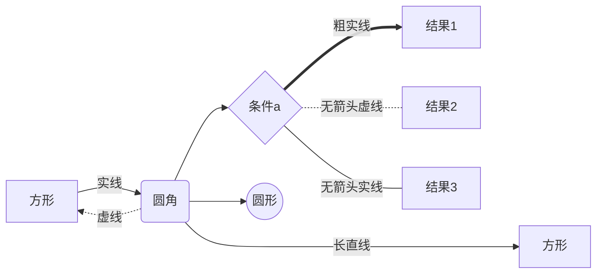
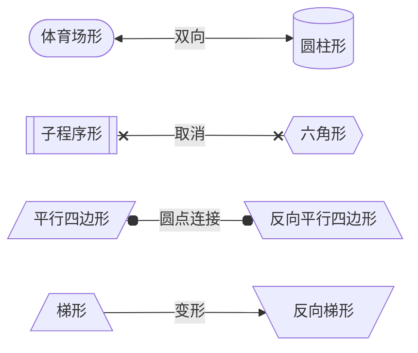
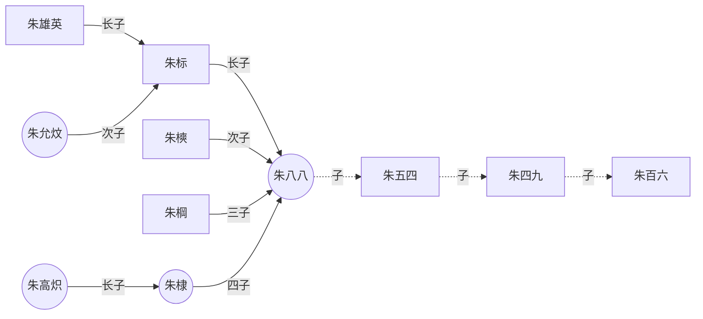
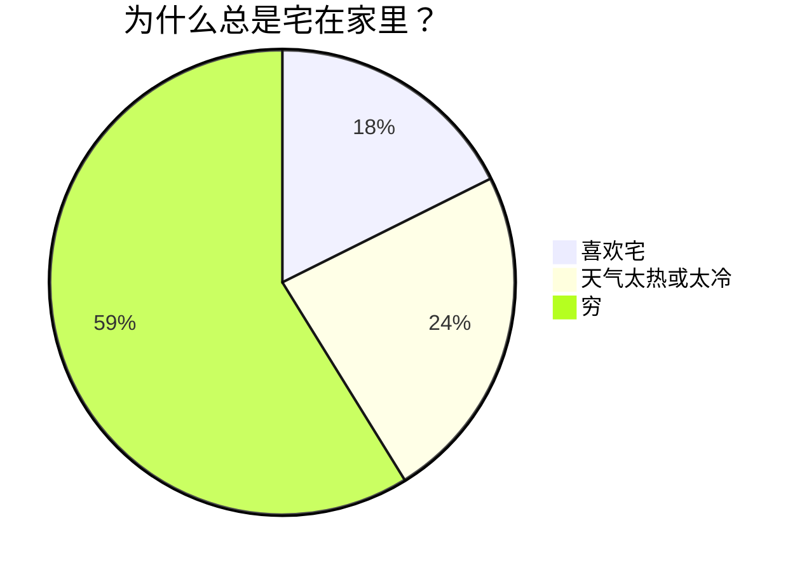
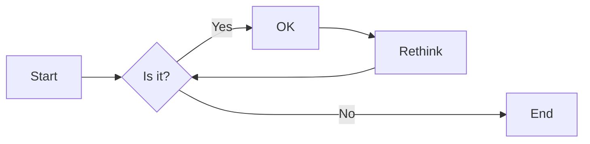
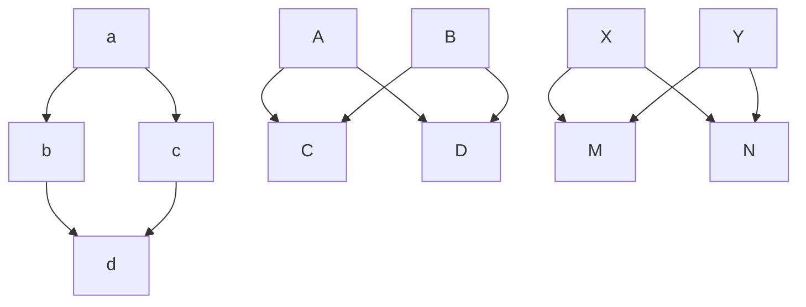
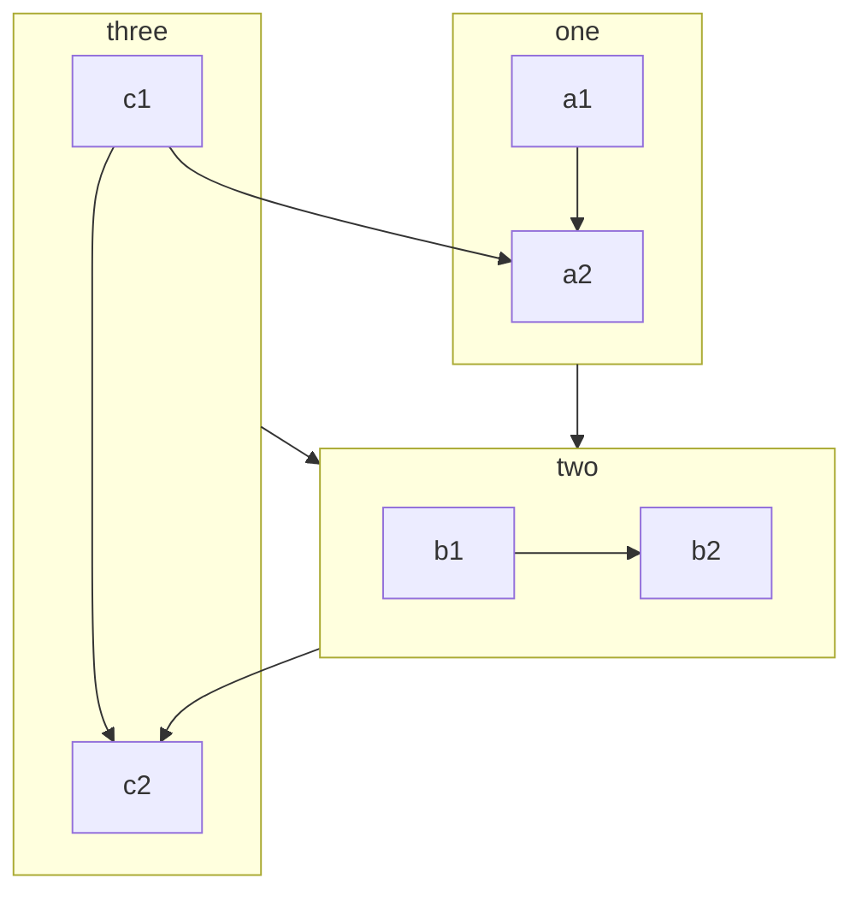
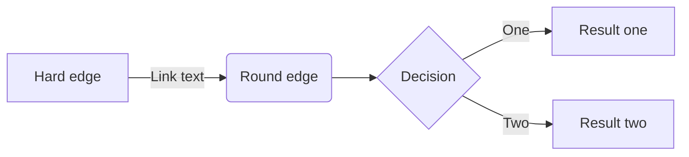

# markdown

## 基础语法

## 流程图绘制

### mermaid

#### 基本图形和线型

```mermaid

graph LR
A[方形] 
B(圆角)
C{条件a}
D[结果1]
E[结果2]
F((圆形))
G[方形]
X[结果3]
 
 
A --实线--> B
B -.虚线.-> A
B --长直线----> G
B --> C
C ==> |粗实线| D
C -.无箭头虚线.- E
C --无箭头实线--- X
B --> F

```

#### 扩展图形和线形

```mermaid

flowchart LR
H([体育场形])
I[(圆柱形)]
J[[子程序形]]
K{{六角形}}
L[/平行四边形/]
M[\反向平行四边形\]
N[/梯形\]
O[\反向梯形/]
H <--双向--> I
J x--取消--x K
L o--圆点连接--o M
N --变形--> O

```

#### 线性图

```mermaid

graph LR
emperor((朱八八))-.子.->朱五四-.子.->朱四九-.子.->朱百六
 
 
朱雄英--长子-->朱标--长子-->emperor
emperor2((朱允炆))--次子-->朱标
朱樉--次子-->emperor
朱棡--三子-->emperor
emperor3((朱棣))--四子-->emperor
emperor4((朱高炽))--长子-->emperor3

```

#### 饼形图

```mermaid

pie
    title 为什么总是宅在家里？
    "喜欢宅" : 15
    "天气太热或太冷" : 20
    "穷" : 50

```

#### 流程图

```mermaid

graph LR
    A[Start] --> B{Is it?};
    B -- Yes --> C[OK];
    C --> D[Rethink];
    D --> B;
    B -- No ----> E[End];
```

#### 多重链

```mermaid

graph 
   a --> b & c--> d
   
   A & B--> C & D
   
    X --> M
    X --> N
    Y --> M
    Y --> N

```

#### 子图 

```mermaid
flowchart TB
    
    c1-->a2
    subgraph one
    a1-->a2
    end
    subgraph two
    b1-->b2
    end
    subgraph three
    c1-->c2
    end
    one --> two
    three --> two
    two --> c2
```

#### 注释

```mermaid

graph LR
%%这是一条注释，在渲染图中不可见
    A[Hard edge] -->|Link text| B(Round edge)
    B --> C{Decision}
    C -->|One| D[Result one]
    C -->|Two| E[Result two]
```

#### 